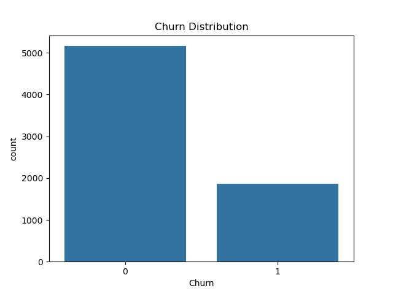

---

## 🛠️ Tools & Technologies

- Python 3
- Pandas, NumPy
- Matplotlib, Seaborn
- Scikit-learn
- Logistic Regression
- Jupyter Notebook

---

## 🔬 ML Process

1. **Data Cleaning** — Missing values handled and irrelevant columns dropped  
2. **Encoding** — Converted categorical data using Label Encoding  
3. **Feature Selection** — Used relevant variables for training  
4. **Modeling** — Logistic Regression  
5. **Evaluation** — Accuracy score, confusion matrix, and classification report

---

## 📊 Sample Visualization



---

## ✅ Model Performance

| Metric       | Value   |
|--------------|---------|
| Accuracy     | 80%     |
| Precision    | 78%     |
| Recall       | 72%     |

> These results are based on logistic regression. Other models (e.g., Random Forest, XGBoost) can be tested for improvement.

---

## 💼 Freelance Use Cases

✅ This type of project can help:
- Telecom companies retain customers
- E-commerce platforms predict repeat buyers
- Subscription businesses identify cancellation risk

If you're a business or startup looking to apply churn prediction to your data, feel free to contact me.

---

## 🚀 How to Run Locally

1. Clone this repo:
```bash
git clone https://github.com/SubhanAli-creator/customer-churn-prediction.git
